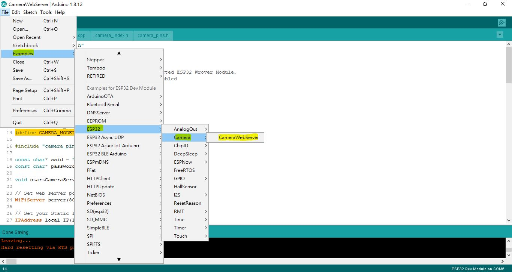
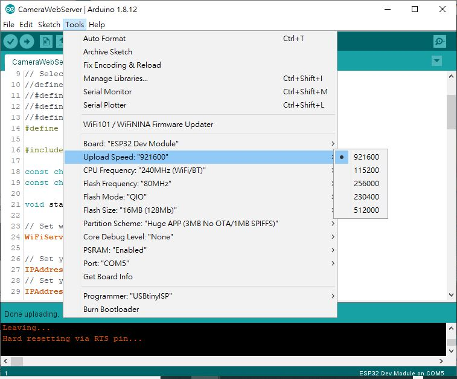
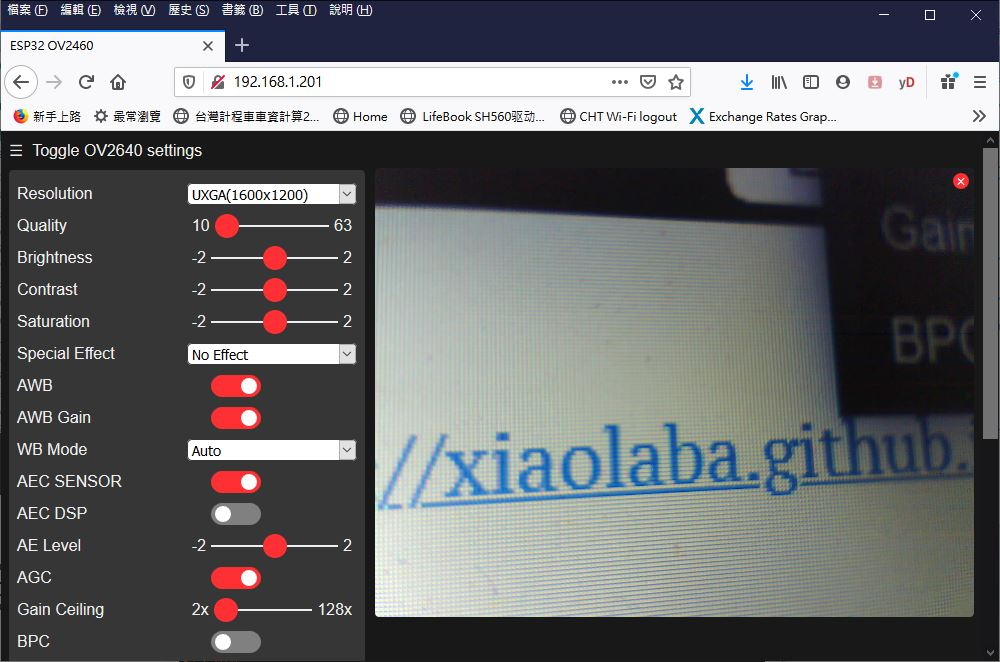
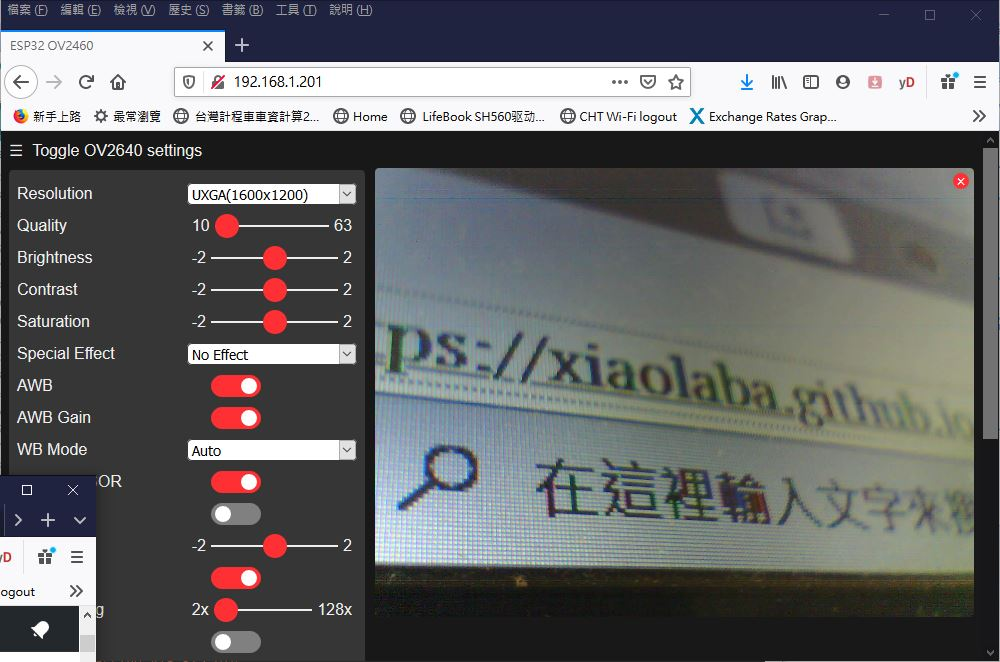
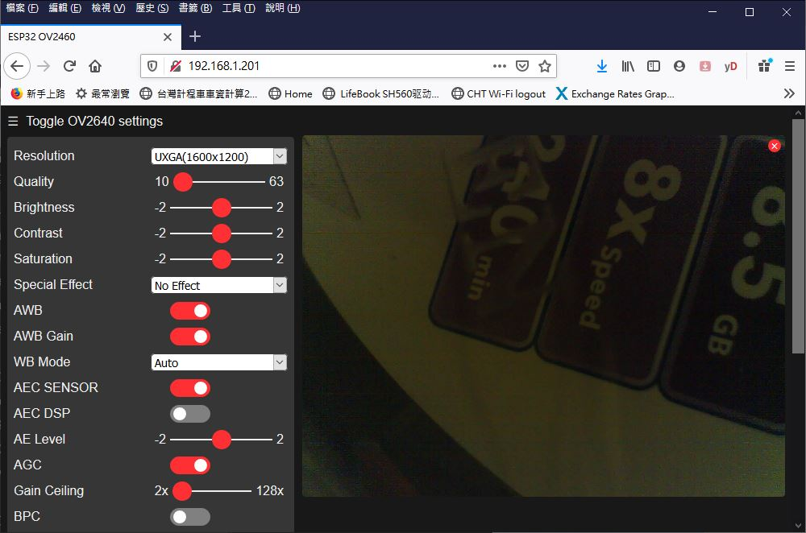
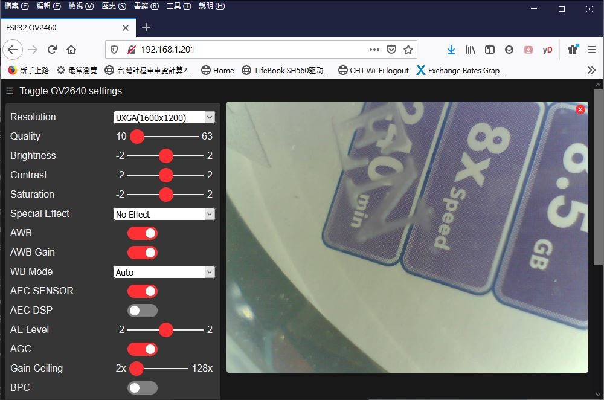

# ESP32-CAM_OV2460_testing
### test the ESP32-CAM, connect to local WIFI router, uses static IP 192.168.1.201  

the code was example and supplied by ESP32/Arduino, change those followings for the test,

load source code, Arduino/IDE/Example/ESP32/CameraWebServer,

change the soruce code before compiling,
* select Camera, #define CAMERA_MODEL_AI_THINKER  
* changed SSID & password, connect to local WIFI  
* add code for static IP address, 192.168.1.201  

### Result,
UXGA 1600x1200 frame rate is real slow, about 8 seconds for frame update sometime, perhaps WIFI stack or setting not optimized.  

### hardware used,
ESP32-CAM or clone, like this,   

### software or setting on compile time,
Arduino IDE 1.8.12  
loading,  
  
..
compile setting,  
  

### captured screen of ESP32-CAM server,  

OV2460_testing1-40mm.JPG  
  

OV2460_testing2-30mm.JPG  
  

OV2460_testing3-35mm_no_light.JPG  
  

OV2460_testing3-35mm.JPG  
  

